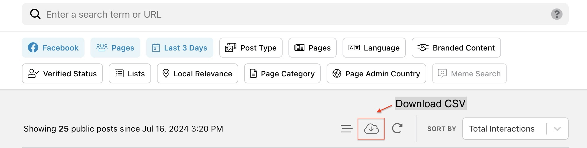

# crowdtangle-jupyter-nb
Jupyter Notebook Template: CrowdTangle CSV Analysis

# What is CrowdTangle?

CrowdTangle is a public insights tool from Meta that makes it easy to follow, analyze, and report on what’s happening with public content on social media platforms like Facebook, Instagram, Reddit and X. Many journalists, fact-checkers, and researchers use CrowdTangle on daily basis to monitor breaking news, content that plausibly violates community guidelines. 

The tool allows users to search content on Facebook dating back to a decade with filters to search like verified accounts, country of page's admin, category of pages and many more. But perhaps most useful feature for researchers was to download search results in a form of a detailed CSV file.

Meta is phasing out CrowdTangle on August 14, 2024 and replacing it with Meta Content Library (MCL) & Content Library API. The civil society has concerns regarding capabilities of the MCL.

# Jupyter Notebooks For CrowdTangle

This repository contains three Jupyter Notebooks which shows how easy it is created templates to analyze CrowdTangle CSVs. 

- **ct-1db-2kw.ipynb**: This notebook allows a user to import CrowdTangle (CT) database (DB) in CSV format and compare the occurrences of two unique keywords (KW). The user can update the keywords in code line 3. Upon running the codes, the user will get the data on the number of occurrences for each keyword, a pie-chart representation of this data, and a list of page names that mention the keyword.
- **ct-2db-1kw.ipynb**: As the name suggests, the notebook allows you to compare a keyword's occurrence in two databases. The final output is in the form of 2 CSVs that include the results based on the keyword selected. The keyword can be edited in code line 4.
- **ct-region-mediaoutlets.ipynb**: This notebook allows you to extract links to Facebook Pages from the CT.DB. It has been used to extract a list of Facebook Pages categorized as Media News Company, Newsagent Newsstand, News Personality, News Site, Newspaper, Political Candidate, Political Party, Politician, and Political Organization in the Palestine Occupied Territories.

## Getting Started

- Install Pandas https://pypi.org/project/pandas/ 
- Install Jupyter Notebook https://jupyter.org/install 
- Install Matplotlib https://pypi.org/project/matplotlib/ 

If you can start Pandas, all you have to do is change keywords to begin you data analysis. Ideal for researchers and journalists who are not familiar with coding (like me). 

